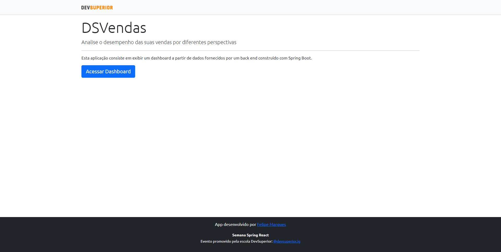
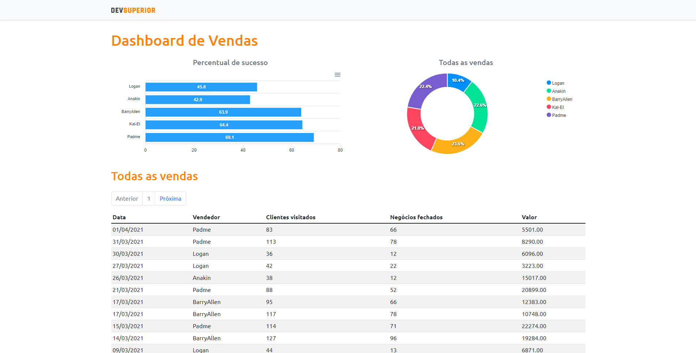

# Dashboard de Vendas

## A dashboard meant to structuraly exhibit data related to sellings

>Dashboard de Vendas is a webpage that retrieves data from local and cloud databases and shows them in an interactive manner.

Landing Page

Dashboard Page

## Features

- Landing Page
- Dynamic data exhibition

## Tech

A couple of technologies were employed in this project. Among them:

- [ReactJS] - a JavaScript library for building user interfaces
- [Spring Boot] - a framework for creating standalone applications that run on their own, without relying on an external web server
- [Yarn] - a package manager
- [Bootstrap] - a framework that allows quick design and customization of responsive mobile-first sites
- [ApexCharts] - a free and open-source modern charting library
- [Netlify] - a web hosting and automation platform that accelerates development productivity
- [PostgreSQL] - an open source object-relational database system
- [Heroku] - a cloud platform that allows developers build, deliver, monitor and scale apps
- [React Router DOM] - a package that enables one to implement dynamic routing in a web app
- [Axios] - a Javascript library used to make HTTP requests

    [ReactJS]: https://reactjs.org/
    [Spring Boot]: https://spring.io/
    [Yarn]: https://yarnpkg.com/
    [Bootstrap]: https://getbootstrap.com/
    [ApexCharts]: https://apexcharts.com/
    [Netlify]: https://www.netlify.com/
    [PostgreSQL]: https://www.postgresql.org/
    [Heroku]: https://www.heroku.com/
    [React Router DOM]: https://v5.reactrouter.com/web/guides/quick-start
    [Axios]: https://axios-http.com/docs/intro
